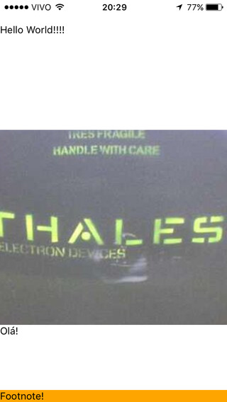

# Purescript ReactNative Skeleton app for use in Expo



# Pre-requisites

0. npm version ~ 5.8.0.
1. `npm install -g bower pulp create-react-native-app`
   * pulp 12.0.1
   * purescript 0.11.7
   * bower 1.8.4
   * yarn 1.6.0
2. [entr](http://entrproject.org/).

# Creating a skeleton Purescript ReactNative app

1. `create-react-native-app skeleton-app && cd skeleton-app`
2. Put the following into `bower.json` (create it):
```json
{
  "name": "skeleton-app",
  "ignore": [
    "**/.*",
    "node_modules",
    "bower_components",
    "output"
  ],
  "dependencies": {
    "purescript-prelude": "^3.2.0",
    "purescript-console": "^3.0.0",
    "purescript-dispatcher-react": "^3.1.0",
    "purescript-reactnative": "^5.0.0",
    "purescript-argonaut-codecs": "^3.2.0"
  },
  "devDependencies": {
    "purescript-psci-support": "^3.0.0"
  }
}
```
3. `bower install` .
4. Create `src/Main.purs` and copy the contents from the file in this repo. Also, copy the image, `src/Images.purs`, `src/Images.js` if you want more than text.
5. Substitute the contents of `App.js` for this:

```node
const Main = require('./index');
export default Main.app;
```

6. Create a `compile.sh` with the following contents:

```bash
#!/bin/bash

pulp build --to index.js --skip-entry-point \
     && (echo 'module.exports.app = PS.Main.app;' >> ./index.js)
```

7. `chmod +x compile.sh` .

8. `ls **/*.purs | entr ./compile.sh` .

9. `npm start` .
10. Scan the QR code with [Expo](https://expo.io/) in your phone.
11. Happy hacking your Hello World in Purescript for React Native!! 🍺
